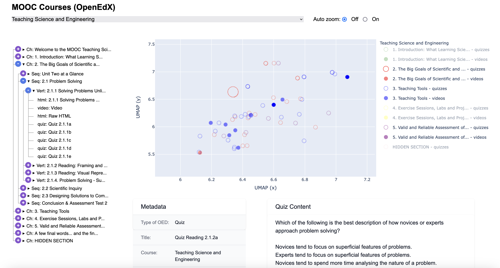

# mooc-embeddings-visualizer
A web-based tool for visualizing the embeddings from lectures and quizzes from MOOC courses via UMAP.

This web-based application  was developed as an internal tool to visualise the semantic connections between quizzes and lectures from MOOC courses when encoded with text embedding models. To reduce the dimensionality of the embeddings to a plottable two-dimensional space, we used the method for dimensionality reduction UMAP. 
The application has two main functionalities. Firstly, it allows the user to visualise the embedding space as an Interactive Scatter Plot containing the quizzes and transcript from the video lectures from all courses at once, providing a general overview of the semantic connections between the content from the different MOOC courses. 

Link (accessible from EPFL network): [Embeddings Explorer](https://go.epfl.ch/embeddings-explorer)

